# ☕ CoffeeShop Web Application

---

## 📝 Mô tả dự án

**CoffeeShop** là một website bán cà phê trực tuyến được xây dựng bằng **.NET Framework**. Ứng dụng hỗ trợ người dùng duyệt sản phẩm, thêm vào giỏ hàng, đặt hàng và quản lý đơn hàng. Trang Admin được tích hợp để quản lý sản phẩm, đơn hàng và người dùng.

---

## 🚀 Tính năng chính

- 📦 Hiển thị danh sách sản phẩm cà phê kèm hình ảnh, mô tả và giá.
- 🔍 Tìm kiếm và lọc sản phẩm theo danh mục.
- 🛒 Thêm sản phẩm vào giỏ hàng, cập nhật số lượng, xóa sản phẩm.
- 👤 Đăng ký và đăng nhập người dùng.
- 🧾 Đặt hàng, lưu thông tin đơn hàng.
- 🛠️ Trang Admin: quản lý sản phẩm, người dùng và đơn hàng.

---

## 🛠️ Công nghệ sử dụng

- ✅ .NET Framework
- ✅ ASP.NET MVC / Web Forms
- ✅ Entity Framework / ADO.NET
- ✅ SQL Server
- ✅ HTML / CSS / Bootstrap
- ✅ JavaScript / jQuery

---

## 🖥️ Mô phỏng dự án

### 1. Giao diện Người dùng

#### Trang đăng nhập

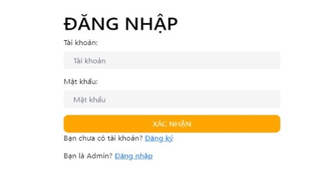

#### Trang đăng ký

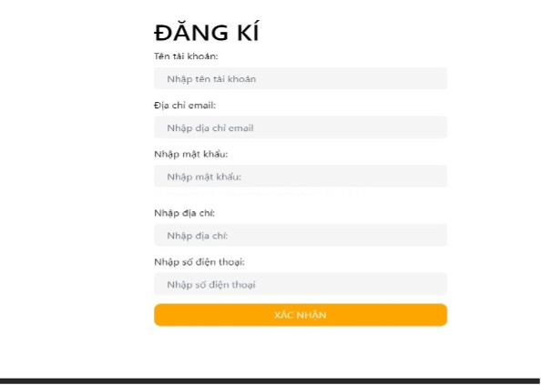

#### Trang chủ

  
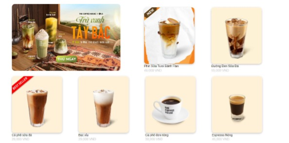

#### Trang chi tiết sản phẩm

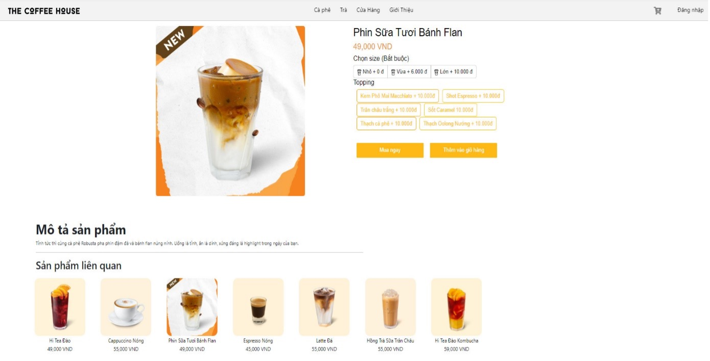

#### Trang sản phẩm

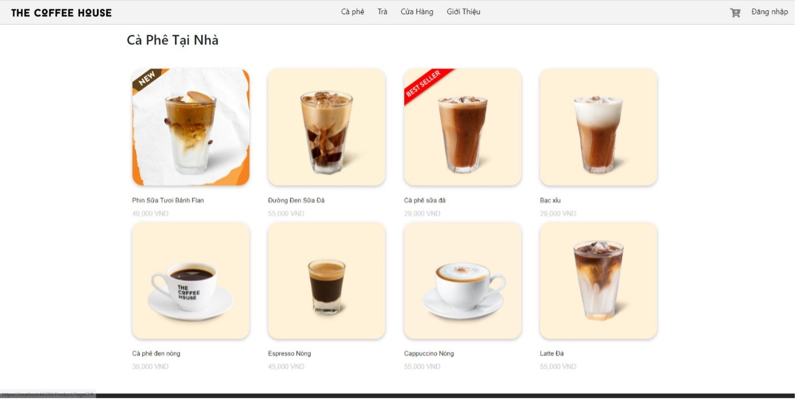  
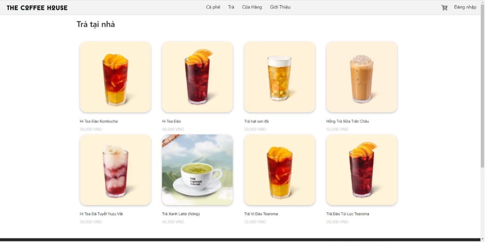  
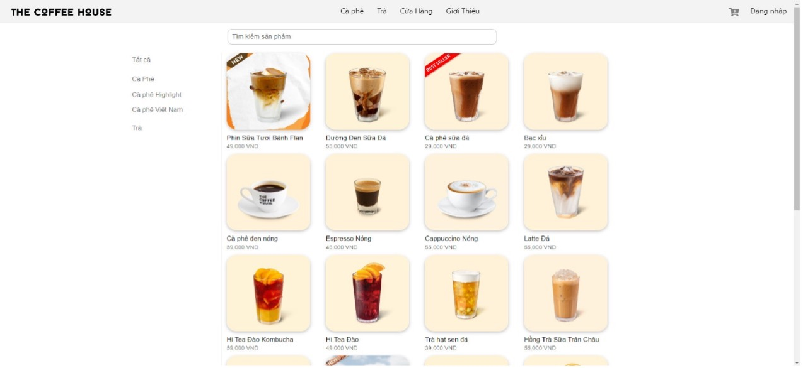

#### Trang giỏ hàng

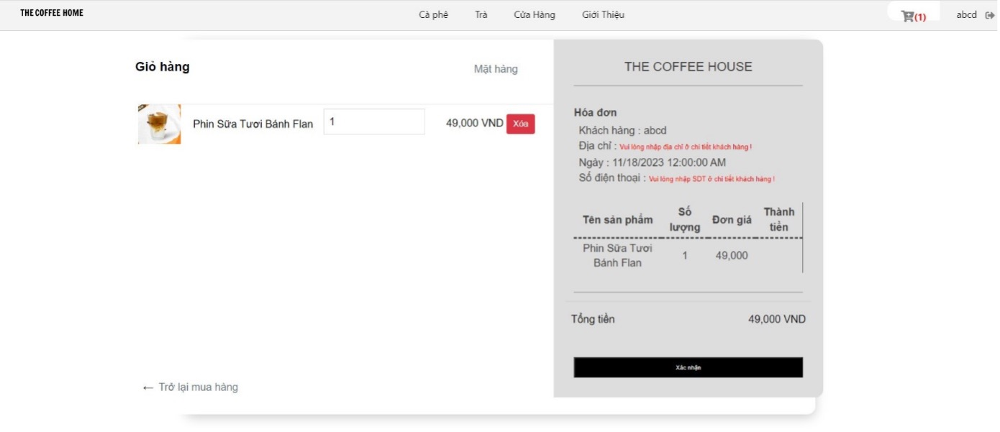

---

### 2. Giao diện Admin

#### Trang tạo mới sản phẩm

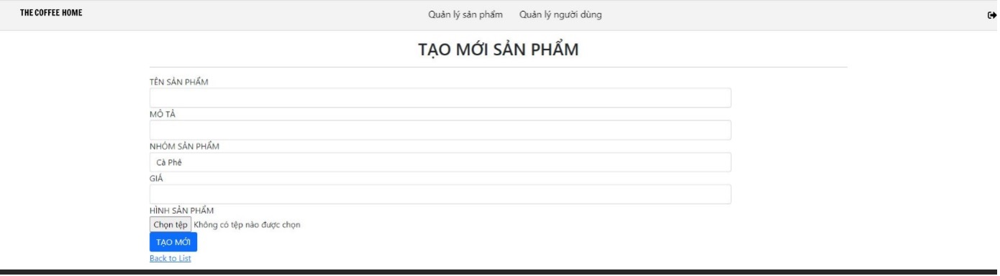

#### Trang quản lý sản phẩm

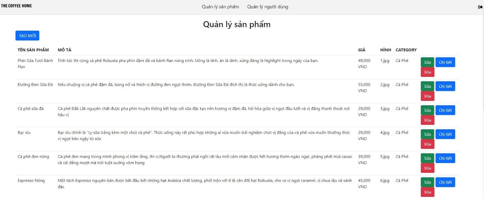

#### Trang quản lý người dùng

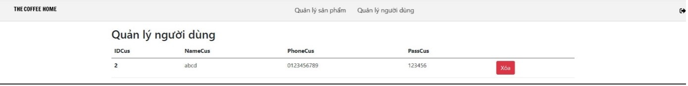

---

## 📁 Cấu trúc thư mục

| Thư mục      | Mô tả                              |
| ------------ | ---------------------------------- |
| Controllers/ | Chứa các Controller xử lý logic.   |
| Models/      | Chứa các lớp đại diện dữ liệu.     |
| Views/       | Chứa các giao diện hiển thị HTML.  |
| Content/     | Chứa CSS, style.                   |
| Scripts/     | Chứa các tệp JavaScript và jQuery. |
| Images/      | Chứa các tệp hình ảnh của dự án.   |

---

## 🚀 Hướng dẫn cài đặt và chạy dự án

1. Clone repository:
   ```bash
   git clone https://github.com/Duypham14063003/The-Coffee-Shop.git
   ```
2. Mở project bằng VS
3. Cấu hình kết nối tới cơ sở dữ liệu SQL Server trong file web.config.
4. Build và chạy ứng dụng

## Tác giả

- Phạm Ngọc Duy
- Email: ngocduy14062003@gmail.com

## 📄 License

Project được cấp phép theo [MIT License](LICENSE).
